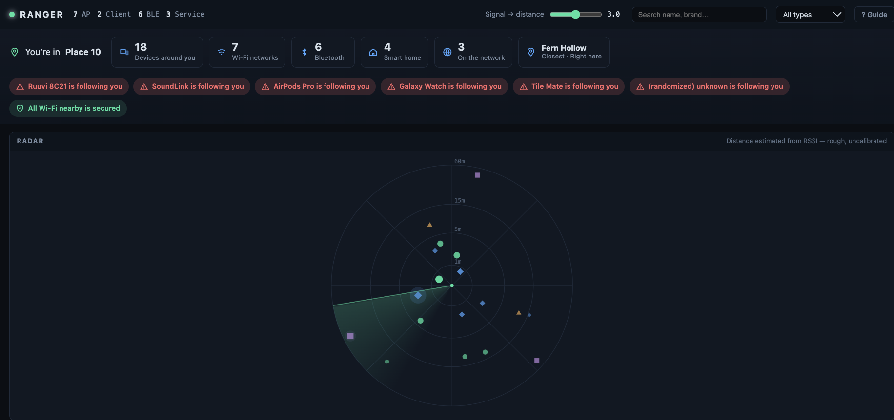
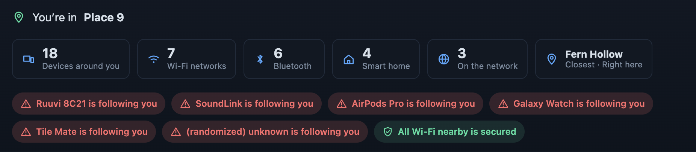
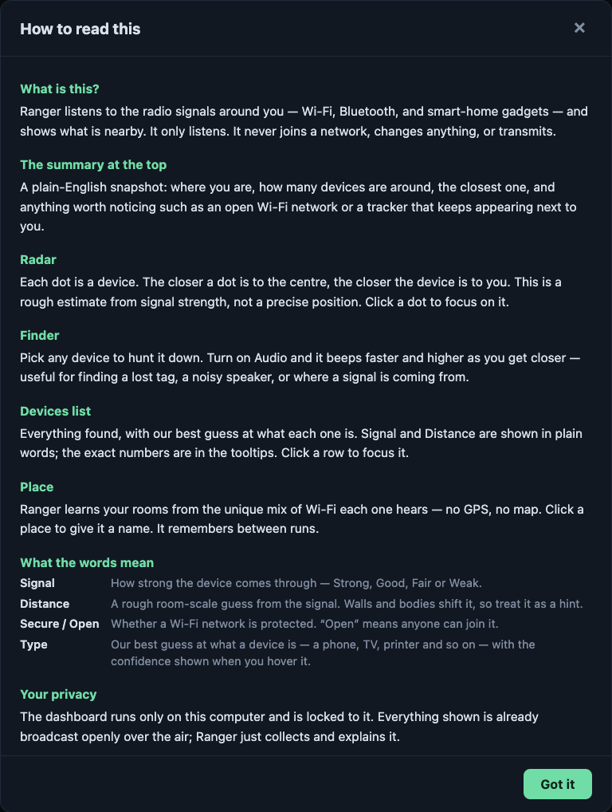
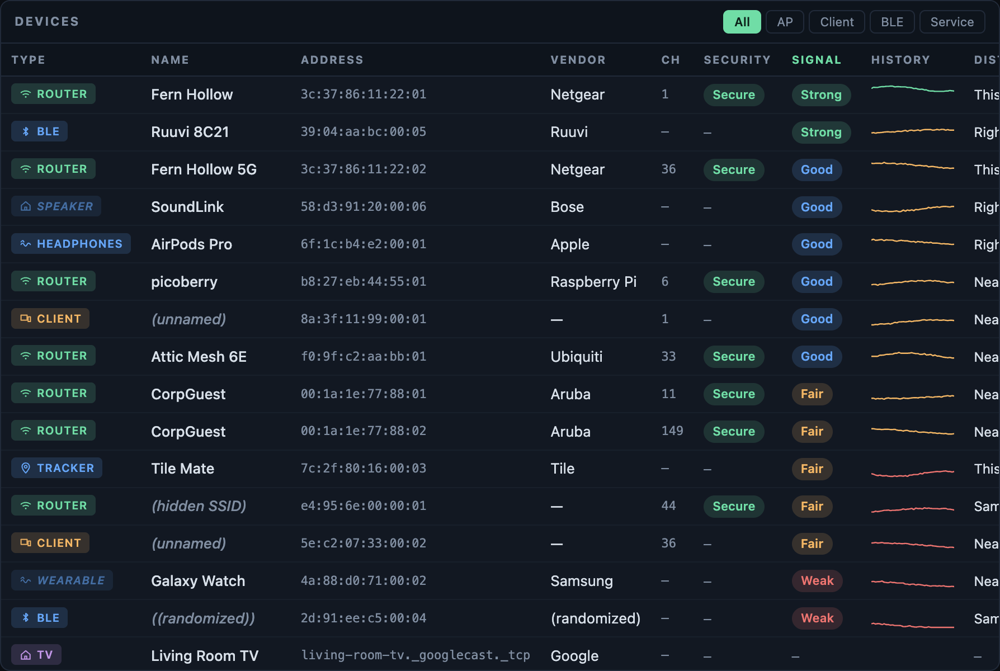

# ranger

A wireless survey tool in Go. It scans Wi-Fi, Bluetooth LE, and local network
services, merges everything into one device registry, and streams it live to a
browser dashboard with a radar, spectrum chart, signal history, and a
hot-cold proximity finder. A plain-language overview and a built-in guide make
it readable without a networking background.

Runs on macOS and Linux.



## Build and run

```sh
go build ./cmd/ranger
./ranger -open
```

Ranger prints a URL containing a one-time token:

```
Ranger is live:  http://127.0.0.1:8787/?token=...
```

Opening it exchanges the token for a session cookie. The server binds to
loopback only.

Try it without any radios or permissions:

```sh
./ranger -fake -open
```

## What it detects

| Source | Gives you | Needs |
| --- | --- | --- |
| Wi-Fi APs | SSID, BSSID, RSSI, channel, width, band, security | Location Services (macOS), `CAP_NET_ADMIN` (Linux) |
| Bluetooth LE | address, RSSI, local name, company ID, Apple continuity type | Bluetooth permission |
| mDNS / DNS-SD | AirPlay, Chromecast, printers, HomeKit, SSH hosts | a multicast-capable interface |
| Wi-Fi clients | client MACs, probe-request SSIDs | monitor mode, root, `-tags pcap` |

A backend that cannot run stays registered and explains itself in the dashboard
instead of disappearing.

## Reading the dashboard

The dashboard is meant to be legible without a networking background. A summary
strip across the top answers the obvious questions in plain language: where you
are, how many devices are nearby, which one is closest, and anything worth
noticing, such as an open Wi-Fi network or a device that keeps following you.



In the device table the jargon is translated to words. Signal strength reads
*Strong* through *Weak*, distance reads *Right here* through *Far away*, and
Wi-Fi security reads *Secure* or *Open*; the exact figure — dBm, metres, WPA3 —
stays in the tooltip. Each row carries an icon for the device's guessed type, and
a **? Guide** button, open on first run, explains every panel and term.



## Identifying objects

Ranger guesses what each device physically is — printer, TV, speaker, wearable,
tracker, router — by weighing four independent kinds of evidence:

| Evidence | Strength | Example |
| --- | --- | --- |
| mDNS service type | strongest | `_ipp._tcp` is a printer, `_googlecast._tcp` is a TV |
| BLE service UUID | strong | `0x180D` heart rate is a wearable, `0x1812` HID is a keyboard |
| Apple continuity subtype | strong | *Proximity Pairing* is AirPods, *Find My* is a tracker |
| Vendor and name | medium | Sonos, LaserJet, WHOOP |

Hover a type badge to see exactly which hints produced it. Confidence falls when
a second category scores nearly as well, and a badge below 50% is dimmed and
italic rather than hidden, so a wrong guess stays visible and checkable. Signals
that are genuinely ambiguous — Apple's *Nearby* and *Find My* are broadcast by
phones, laptops and tags alike — deliberately stay tentative.



Ranger also separates devices that never move from ones being carried, using the
p90−p10 spread of their signal. That distinction matters for the next feature.

## Recognising places

The set of access points you can hear, and how strongly you hear each one, is
effectively a signature for a location. Ranger samples that signature every few
seconds and compares it against ones it has seen before:

$$\text{sim}(A,B) = \frac{1}{2}\left(\underbrace{\frac{2|A\cap B|}{|A|+|B|}}_{\text{Dice}} + \underbrace{\frac{|A\cap B|}{\min(|A|,|B|)}}_{\text{containment}}\right) \times \underbrace{\frac{1}{|A\cap B|}\sum_{i \in A\cap B}\max\left(0,\ 1-\frac{|r^A_i - r^B_i|}{20}\right)}_{\text{signal agreement}}$$

Above the threshold it is the same place; below it, a new one is learned. No GPS,
no map, no training data — rooms are discovered by clustering as you move. Click
a place to name it. Places persist between runs.

Three details make this work in practice:

- **Only stationary devices become anchors.** Including a phone would make the
  signature follow its owner from room to room.
- **Containment is blended with Dice** so a partial scan still matches a known
  place. Dice alone re-learns your kitchen every restart.
- **Switching requires a margin** over the current place, otherwise standing in
  a doorway makes the answer oscillate.

Ranger listens for 25 seconds before learning anything, so a half-built
signature is never committed as a place.

## Detecting movement

A body crossing the path between the receiver and a stationary transmitter
absorbs and reflects the signal, so its reported strength wobbles. Ranger
measures how much every anchor wobbles and compares that against how much it
wobbles when the room is still.

This reports only that the radio environment was disturbed. It cannot say what
moved, count people, or locate anything. Sensitivity depends entirely on how
often the anchors report: a Bluetooth beacon advertising several times a second
is useful, a Wi-Fi access point scanned every eight seconds barely is. The panel
shows the live anchor count and sample rate so you can judge for yourself.

One subtlety worth knowing: anchors are *not* filtered by the classifier's
"fixed" label. Mobility is judged from signal spread across a device's whole
history, and a stationary beacon in a room where people walk about shows exactly
that spread — so filtering on "fixed" would discard the very anchors that reveal
movement. Only clearly portable devices are excluded.

## Devices that follow you

Once several places are known, ranger watches for Bluetooth devices that keep
reappearing beside you in different ones. A device present in three or more
distinct places over at least ten minutes is flagged prominently.

Most Bluetooth devices rotate their address, which normally defeats this. The
case that matters is the exception: a tracker separated from its owner stops
rotating and keeps a single address for many hours, so the tag genuinely
following a stranger is exactly the one this can see. Coincidences happen —
the alert says so.

## Reading sensor beacons

Many Bluetooth advertisements carry a payload rather than just an identifier.
Ranger decodes iBeacon (UUID, major, minor), Eddystone (UID, URL, telemetry),
Ruuvi environmental tags (temperature, humidity, pressure, battery), and the
ATC and pvvx thermometer firmwares. Select a device to see its readings.

Every byte here arrives unauthenticated over the air, so each decoder
length-checks before indexing and rejects payloads carrying control characters.

### What this cannot do

Without extra hardware it cannot identify objects that have no radio, and
laptop-only movement detection only says *something* moved. Recognising a still
body — or its breathing — needs Channel State Information, which a normal Wi-Fi
card does not expose through libpcap. That is what the ESP32 sensor below adds.

Distances are estimates, not measurements. See below.

## Through-wall sensing with an ESP32

A laptop reports one RSSI number per frame. An ESP32 exposes the full channel
response — amplitude for every OFDM subcarrier, tens of times a second. That
resolution is enough to sense a still body: presence, gross motion, and even
breathing, since a chest modulates the subcarriers by a fraction of a dB at
about 0.2 Hz.

Any ESP32 works; a plain **ESP32-DevKitC** or **ESP32-S3** (~$5) is ideal. Flash
the sketch in [firmware/esp32-csi](firmware/esp32-csi/esp32-csi.ino) with your
Wi-Fi credentials and the ranger host's IP, then:

```sh
go build ./cmd/ranger
./ranger -csi -open
```

The ESP32 streams CSI over UDP to `:5566`; ranger analyses it and shows a
Through-wall sensing panel with presence, a motion bar, a breathing estimate,
and the live channel response.

How it works:

- **Presence and motion** come from how much the subcarriers wobble versus a
  still-room baseline, at far higher resolution than RSSI allows.
- **Breathing** is recovered by linearly detrending the most active
  subcarriers and scanning the 6–36 breaths-per-minute band with a DFT that
  uses real packet timestamps, so jitter does not smear the estimate. It is
  reported only when the periodic peak clears a strict noise threshold, so a
  quiet channel says nothing rather than inventing a rate.

This is genuinely finicky. Breathing needs a still subject at close range with a
clean, steady CSI stream; gross movement swamps the millimetre chest signal and
suppresses the reading. The panel shows the live frame rate and packet loss so
you can judge the link.

**The CSI port accepts unauthenticated UDP from the local network.** The parser
rejects malformed packets and the sensor count is bounded, but only enable it on
a network you trust. It is off unless you pass `-csi`.

### macOS: Wi-Fi network names

macOS only reveals SSIDs and BSSIDs to processes authorized for Location
Services. Without it, ranger still reports signal strength and channel, but
groups networks into anonymous per-channel entries.

To get names, enable your terminal under **System Settings → Privacy & Security
→ Location Services**, then restart ranger. Ranger registers itself on first run,
so it will already be in the list.

### Linux: triggering scans

Triggering a fresh scan needs `CAP_NET_ADMIN`. Without it ranger falls back to
reading scans other programs have already run, which is slower to update:

```sh
sudo setcap cap_net_admin,cap_net_raw+eip ./ranger
```

## Monitor mode

Capturing raw 802.11 frames reveals devices that never associate with a network,
including the SSIDs phones probe for. It is off by default and needs a separate
build:

```sh
go build -tags pcap ./cmd/ranger
sudo ./ranger -monitor
```

Client MAC addresses are pseudonymised by default: the vendor prefix is kept and
the device half is replaced with a hash salted per run. Disable with
`-anonymize-macs=false`.

Only frame headers are read, never payloads. On macOS, monitor mode disconnects
Wi-Fi while active and cannot change channels, so only the current channel is
observed. On Linux ranger hops channels using `iw`.

**This observes traffic from devices whose owners have not consented. Only run
it on networks you are authorised to survey, and check your local law first.**

## Security

The dashboard exposes a map of your physical surroundings, so the server is
locked down by default:

- binds `127.0.0.1` only; `-allow-remote` is required to do otherwise
- random 256-bit session token, exchanged for an `HttpOnly`, `SameSite=Strict` cookie
- `Host` header validation, blocking DNS rebinding
- `Origin` and `Sec-Fetch-Site` checks, blocking cross-site reads
- CSP with no `unsafe-inline`; all dashboard scripts are separate files

SSIDs and BLE names are attacker-controlled strings, so they are stripped of
control characters, length-bounded, and written to the DOM with `textContent`.

## Distance estimates

The radar and the **Distance** column use a log-distance path loss model:

$$d = 10^{\frac{P_{1m} - \text{RSSI}}{10n}}$$

Transmit power varies per device, and walls and bodies easily shift readings by
10 dB. Treat distances as an ordering hint, not a measurement. The path loss
exponent $n$ is adjustable in the toolbar: 2.0 for open space, 3.5 for a
cluttered interior.

## Flags

```
-listen              address to serve on (default 127.0.0.1:8787)
-open                open the dashboard on startup
-fake                emit synthetic devices instead of scanning
-ttl                 how long a device survives unseen (default 90s)
-token               fixed access token; generated when empty
-allow-remote        permit binding a non-loopback address
-monitor             enable raw 802.11 capture
-monitor-interface   capture interface override
-anonymize-macs      pseudonymise captured client MACs (default true)
-places              learn and recognise locations (default true)
-places-file         where learned places are stored
-place-threshold     similarity counting as the same place (default 0.62)
-place-min-anchors   fewest stable anchors needed to judge (default 3)
-csi                 ingest ESP32 Channel State Information for through-wall sensing
-csi-listen          UDP address to receive CSI on (default 0.0.0.0:5566)
-dev                 serve assets from ./web instead of the embedded copy
-v                   debug logging
```

## Layout

```
cmd/ranger        flags, wiring, signal handling
internal/core     device model, registry, event bus
internal/scan     scanner interface, supervisor, radio backends
internal/classify object type inference from advertised evidence
internal/beacon   iBeacon, Eddystone, Ruuvi and thermometer payloads
internal/place    location fingerprinting and clustering
internal/motion   movement detection from anchor signal variance
internal/csi      ESP32 CSI ingest: presence, motion, breathing
internal/insight  place state, motion, and follow alerts
internal/geo      RSSI to distance
internal/oui      MAC and Bluetooth company lookup
internal/server   HTTP, SSE, auth
web/              dashboard, embedded into the binary
firmware/         ESP32 CSI sensor sketch
```

Every backend implements `scan.Scanner`. Adding a radio means implementing
`Name`, `Check`, and `Run`, then adding it to `scan.Platform`.
